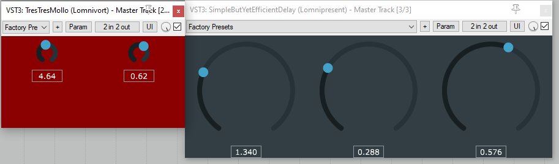
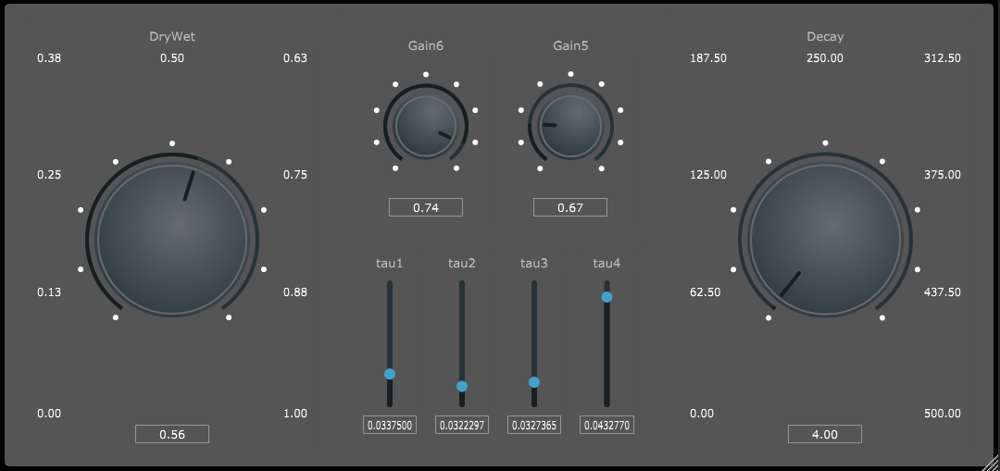

## What is this repo ??

This repository is a collection of small plugins (VSTs here but they can be whatever format suported by JUCE) I am developpign using the JUCE framework. The UIs are as simplistic as possible as I am focusing on the audio processing part !

For the moment there are three plugins available.

Keep in mind that these plugins are written so that I learn the DSP/Audio processing part of code, the GUIs are ugly and the VSTs are not really meant to be used everyday in your daw (no save)

# TresTresMollo

This is a tremolo plugin I wrote its quite simplistic as at the time I was discovering JUCE.

# Simple Delay

This is a fairly basic delay I wrote using a custom delay class where I re-implemented all the code necessary for a delay.

# Schroeder Reverberator

This is a classic Schroeder Reverb.

N.B for the processing part everything was wrote by myself as a small challenge (circular buffer etc)*

